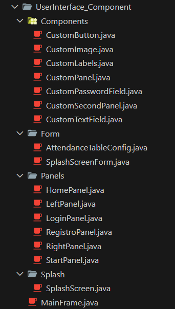

# Manual Técnico: Sistema de Control de Asistencia CheckLyn

Escuela Politécnica Nacional

Proyecto del Segundo Bimestre

Autores:

* Erick Chicaiza
* Jhostin Garcia
* Mateo Guamaní
* Steven Echeverría
* Alex Flores

## 1. Introducción

El presente proyecto consiste en el desarrollo de una solución integral para la gestión y control de asistencia estudiantil mediante tecnología de identificación por radiofrecuencia (RFID). El sistema ha sido diseñado para optimizar el registro manual, reduciendo errores humanos y proporcionando datos en tiempo real sobre la presencia de los alumnos en la institución.

La arquitectura del software se basa en capas desacopladas (N-Layer) para facilitar el mantenimiento y la escalabilidad. Se destaca la implementación de un componente de hardware a través de comunicación serial (RS-232/USB) con dispositivos RFID, cuya lógica de lectura ha sido abstraída en controladores especializados para no comprometer el rendimiento de la interfaz de usuario.

Un aspecto técnico crítico resuelto en esta versión es el manejo de la integridad de datos mediante borrado lógico. A través del uso de índices únicos parciales en la base de datos SQLite, el sistema permite la reutilización de tags RFID y la re-inscripción de estudiantes sin perder el historial de registros previos, cumpliendo así con los estándares de persistencia exigidos en la ingeniería de software moderna.

## 2. Objetivos del Sistema

* Automatizar el proceso de toma de asistencia en unidades educativas mediante el uso de hardware RDIF para minimizar el error humano y mantener un mayor control sobre la presencia de los estudiantes.
* Fomentar la modernización tecnológica de la educación en nuestro pais mediante la implementación futura del proyecto en unidades educativas fiscales para promover el desarrollo de nuevas soluciones a problematicas estancadas en soluciones pasadas.

## 3. Arquitectura del Sistema
Como se ha mencionado, el sistema cuenta con una arquitectura en capas, las cuales facilitan la separación de responsabilidades.

* __User Interface (Capa de presentación):__ Esta cuenta con 4 niveles.
  
  El primer paquete, components, presenta elementos personalizados de la paqueteria Java Swing como lo son botones, labels, paneles, etc. Esto busca dar un diseño más actual y una buena vista para el usuario.

  

  El segundo paquete contiene Forms, en donde se halla la configuracion de visualiazación del Splash de inicio del sistema además de una clase que ayudará en la creación futura de las tablas.

  El tercer paquete contiene los paneles, lo cual facilita encontrarlos dentro de la UI y poder realizar cambios si llega a ser necesario

  Por ultimo, tenemos el SplashScreen dentro de su propio paquete y además del MainFrame el cual es el contenedor de laSS UI.

  

* __Business_Logic__: Aqui se ha guardado la implemenación del diagrama de clases. Este consta de una carpeta llamada Entities, la cuál almacena la logica de busqueda de estudiantes por su numero de cédula, además de un incluir la clase FactoryBL, la cual gracias a estar definido con el tipo de variable genérica puede ser usada por cuaquiero clase que tenga su DTO y DAO respectivo.

* __DataAccess__: Esta es la capa que nos permite interactuar con los datos dinámicos de las tablas. Gracias a un DataHelperSQLiteDAo que implementa la IDAO, este facilita la realización del CRUD en cada una de las tablas. De esta forma se comunica con el FactoryBL en la capa superior.

* __Infrastructure__: En este capa se encuentran todos los recursos de diseño, como tipo de fuente, colores, y principalmente el AppConfig y el AppException los cuales ayudan a la gestion de errores y muestra de mensajes personalizados en pantalla

* __Storage__: En este paqueta se almacena todo lo relacionado con la base de datos y sus scripts, además del log el cuál guarda los errores de forma explicita, evitando que informacion sensible se muestre al usuario.

## Diseño de la base de datos

* __Diagrama Entidad Relación (MER)__: 
